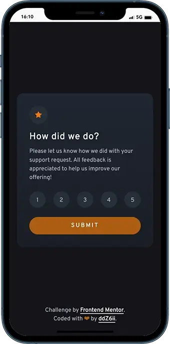
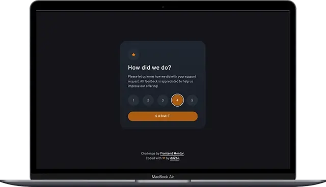

# Frontend Mentor - Interactive rating component solution

This is a solution to the [Interactive rating component challenge on Frontend Mentor](https://www.frontendmentor.io/challenges/interactive-rating-component-koxpeBUmI). Frontend Mentor challenges help you improve your coding skills by building realistic projects.

## Table of contents

- [Overview](#overview)
  - [The challenge](#the-challenge)
  - [Screenshots](#screenshots)
  - [Links](#links)
- [Getting started](#getting-started)
- [My process](#my-process)
  - [Built with](#built-with)
  - [Deployed with](#deployed-with)
- [Useful resources](#useful-resources)
- [Author](#author)

## Overview

### The challenge

Users should be able to:

- View the optimal layout for the app depending on their device's screen size
- See hover states for all interactive elements on the page
- Select and submit a number rating
- See the "Thank you" card state after submitting a rating

### Screenshots

- Mobile:

  

- Laptop/Desktop:

  

### Links

- Solution URL: [frontend-mentor-solution](https://www.frontendmentor.io/solutions/accessible-rating-form-component-with-custom-validation-and-animation-FzWEcNw1Bf)
- Live Site URL: [interactive-rating-component](https://interactive-rating-component-liart-six.vercel.app/)

## Getting started

1. Clone the project and run the following command:

```console
yarn install
```

This will initialize the project by installing all the required dependencies.

2. Start the development server:

```console
yarn run dev
```

3. Build for production (output to the `/dist` folder):

```console
yarn run build
```

## My process

### Built with


- Semantic HTML5 markup
- CSS Grid
- CSS Flexbox
- JavaScript for custom form validation and loading dynamic content
- Vite bundler
- Mobile-first workflow

### Deployed with


## Useful resources

- [ARIA Authoring Practices Guide: Radio Group Pattern](https://www.w3.org/WAI/ARIA/apg/patterns/radio/) - W3C recommended practices for accessibility
- [WebAIM: Usable and Accessible Form Validation and Error Recovery](https://webaim.org/techniques/formvalidation/) - Best practices for custom form validation
- [MDN: The Field Set Element](https://developer.mozilla.org/en-US/docs/Web/HTML/Element/fieldset/) - Semantic way to group related form controls

## Author

- Github - [ddZ6ii](https://github.com/ddZ6ii)
- Frontend Mentor - [ddZ6ii](https://www.frontendmentor.io/profile/ddZ6ii)
- Linkedin - [denis-dezest](https://www.linkedin.com/in/denis-dezest/)
